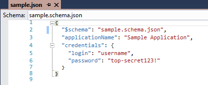
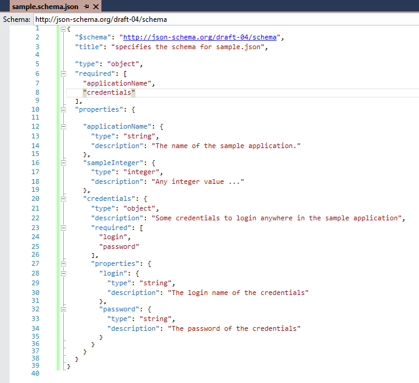
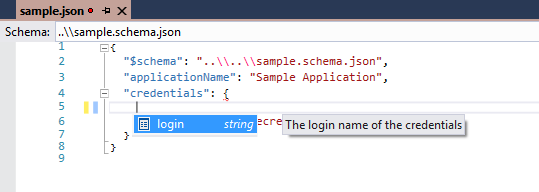
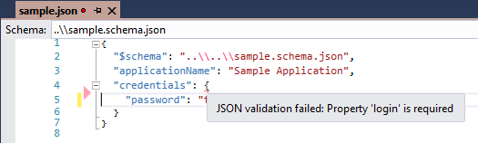
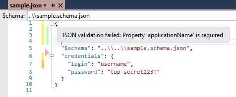
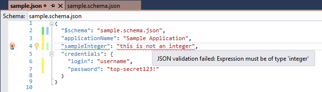

# spring-net-json-variable-source

As resharper does not get along with the default properties files for spring and because we are used to configure things in json format, we decided to use a json-variable-source for spring.net.

This comes with some very positiv side effects:
- Validation of the (json)-config
- Intellisense in Visual Studio when writing the json-file
- complex configuration objects
- No more Resharper errors when opening the properties file
- maybe more ...

This is a sample the json-config-file ...

... for the specified json-schema ...

With intellisense ...

... and validation ...
... for missing properties ...

... for invalid types ...

